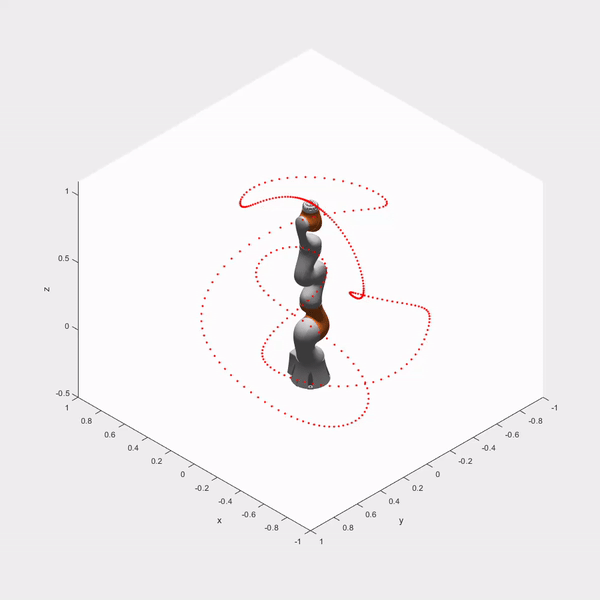

# Optimal Excitation
MATLAB codes for generating optimal excitation trajectories

Example trajectory generated for robust mechanical system identification

 &nbsp;

and some fun extension

 &nbsp;

Exciting!
